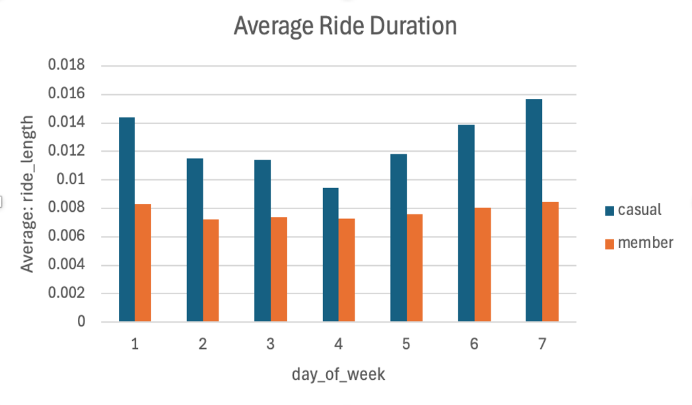
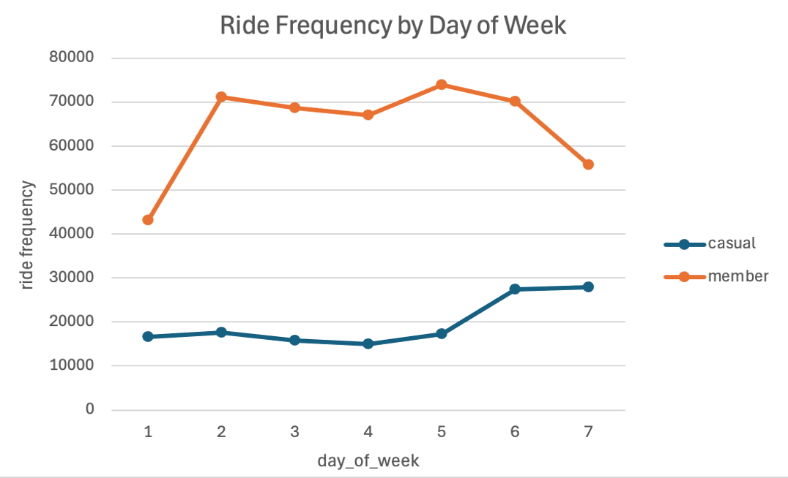

# 🚴 Cyclistic Bike-Share Analysis

## 📌 Project Overview

Cyclistic is a bike-share company looking to increase annual memberships. This project analyzes rider behavior to identify the differences between annual members and casual riders and provides data-driven recommendations to support membership growth.

---

## Business Problem

How do annual members and casual riders use Cyclistic bikes differently, and how can those insights help convert casual riders into annual members?

---

## Dataset

- **Source:** Google Data Analytics Capstone Dataset (Cyclistic)
- **Time Period:** （Jan–Mar 2025）
- **Records Analyzed:** 580K+ ride records

---

## 🛠 Tools & Technologies

- Excel
- Python (Pandas)

---

## Analysis Process

- Cleaned and validated ride data
- Performed exploratory data analysis (EDA)
- Compared rider behavior across customer types
- Created visualizations and dashboards
- Developed business recommendations

---

## 📊 Dashboard

---

## 🔍 Key Findings

- Annual members ride more frequently on weekdays.
- Casual riders are more active on weekends.
- Casual riders have longer average ride durations.

---

## 💡 Business Recommendations

- Launch more promotional packages for members.
- Offer weekend membership promotions targeting casual riders.
- Users who engage in long-distance cycling can enjoy a discount by becoming members.

---

## 📂 Kaggle Notebook

The complete analysis, code, and visualizations are available on Kaggle:
👉 https://www.kaggle.com/code/kaniayu/notebook1-cyclistic-bike-share-analysis

## Author

Kania Yu

Information Systems Student  
University of Utah

LinkedIn: https://www.linkedin.com/in/yayi-yu-3607b1327/
